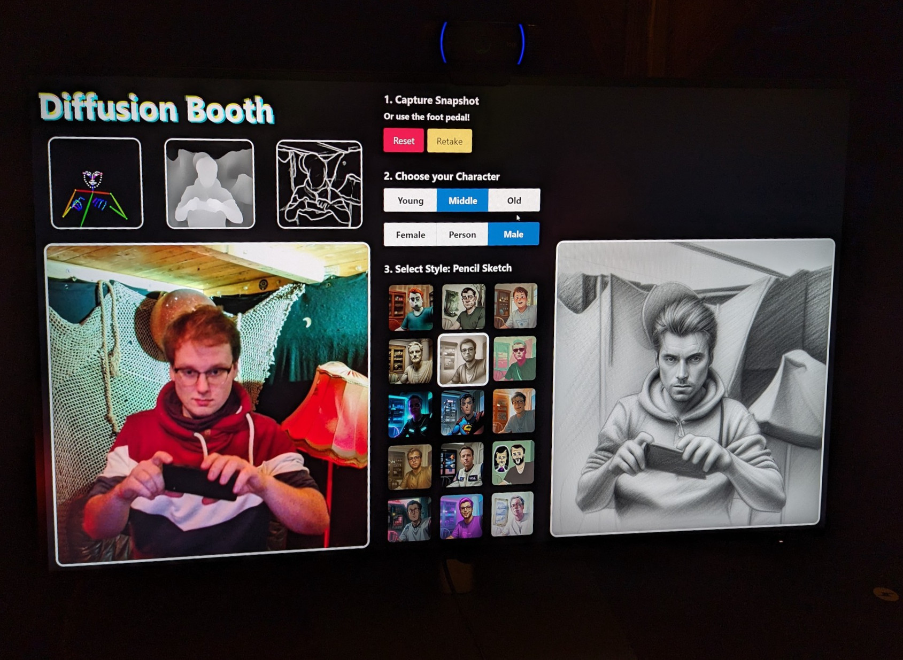

<h1 align="center">Diffusion Booth</h1>
<p align="center">
    Photobooth × Stable Diffusion<br>
    Take a photo and let the AI create a fun and unique portrait of you!
</p>
<div align="center">
    <video autoplay loop muted playsinline>
        <source src="example.mp4" type="video/mp4">
    </video>
</div>
<p align="center">
    <a href="https://csti.haw-hamburg.de/2023/11/21/digital-science-night-5-generation-ai-ich-bin-doch-nur-ein-language-model/">This project was a two-week hack for the 2023 Digital Science Night</a><br>
    See also: <a href="https://github.com/okafke/trAIding-cards">tr<b>AI</b>ding-cards</a>
</p>

## The Setup

You'll need:

1. one computer with a powerful GPU and an installation of the [stable-diffusion-webui](https://github.com/AUTOMATIC1111/stable-diffusion-webui)
2. a thin-client computer with a webcam, which can run the frontend in "kiosk mode"
3. lots of light and some props for a scenerey

### 1. Stable-Diffusion-WebUI

For the general installation, just follow the setup instructions in [their Wiki](https://github.com/AUTOMATIC1111/stable-diffusion-webui/wiki).
You **must** enable the API with `--api` in the `COMMANDLINE_ARGS` variable. If you don't run the frontend on the same computer, you also need to listen on a reachable IP with `--listen`.

Then, the [ControlNets extension](https://github.com/Mikubill/sd-webui-controlnet.git) is required because control nets are an essential part of getting pictures with some resemblance at all. Open the Web UI and navigate to Extensions > "Install from URL".

And finally, you need all the models of course. This part is WIP, until I find out how to host files in LFS without making my University's GitLab team angry. You can find models on [huggingface.co](https://huggingface.co/) and [civtai.com](https://civitai.com/); the names and hashes of all the models we used are noted in [`models_sha256sum`](./models_sha256sum).

You **should enable larger cache** for ControlNet models! Otherwise they need to be reloaded for every API call, which takes unecessarily long time. Go to [Settings > ControlNet (left) > increase "Model cache size"](https://github.com/Mikubill/sd-webui-controlnet/issues/429#issuecomment-1449200295).

During the Digital Science Night, we used a computer with an Nvidia RTX 4070 Ti, which was snappy enough to be fun. An 1080 Ti was "fine" but already a little too slow.

### 2. Run the Frontend



The frontend is built with Vue.js and can be built with `yarn install && yarn run dev`, followed by opening the link in your favourite browser. Preferably, use Firefox in Kiosk mode and just remove the keyboard:

```
firefox -kiosk http://localhost:5173/
```

You'll want to change two things in the code:
* Point the `/sdapi` proxy in `vite.config.ts` to your own Stable-Diffusion-WebUI API.
* Host your own `fileserver/fileserver.py` somewhere and point the URL in `App.vue`'s `upload()` function to it.

The user interface should *hopefully* be self-explanatory. Picture capture is additionally bound to `Shift-S`, which can be triggered with a programmable foot pedal, for example.

### 3. Fun

Let your guests have fun with it.

If you hosted your own fileserver, you can also open its URL on another monitor to show the pictures taken so far in a random gallery.